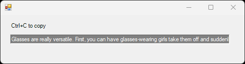

# main.cs

## Licensed under WTFPL（Do What The Fuck You Want To Public License）where applicable && if necessary

## Why
I don't want random apps launching default browser, and sometimes I want redirecting magic links to open in specific browsers.
This app solve that problem by pretending to be a browser and capturing the URL so you can just ignore it, or copy-paste it.

## Compilation instruction
- `C:\Windows\Microsoft.NET\Framework64\v3.5\csc.exe /target:winexe main.cs`  
If above is not found, look for `csc.exe` in your system. Any of those will do.

## Usage
1. Run register_as_browser.reg 
1. Open `regedit`, Go to `HKEY_CLASSES_ROOT\BrowserChooserHTM\shell\open\command` and `\runas\command`
1. Add in path for main.exe in "(DEFAULT)" key: e.g. `(DEFAULT) | REG_SZ | "C:\main.exe" "%1"`
1. Set BrowserChooserHTM as your "browser"
1. All URLs open in this "default browser" so you can copy paste that URL

## Architecture
Spawns a window with a textbox, gets arguments to the app, prints the argument in the textbox for the user to copy.

## Security
Security aspects are not considered in this souce code. wcgw. 
